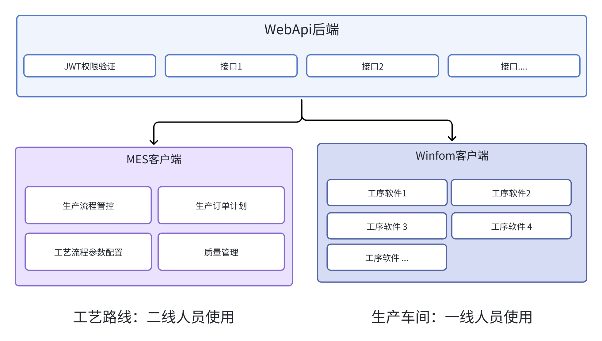

# 小型MES系统框架 (JCF-MES)

一套轻量、可扩展、面向中小型制造企业的 MES（manufacturing execution system 制造执行系统）整体解决方案框架。采用 **WebApi 后端 + 双客户端** 架构，实现从工艺定义、任务下发到现场执行、数据闭环的全生产流程管控。

---

## 目录
- [整体架构设计](#整体架构设计)
- [核心模块详解](#核心模块详解)
  - [1. WebApi 后端框架](#1-webapi-后端框架)
  - [2. MES 客户端框架 (JCF.MES)](#2-mes-客户端框架-jcfmes)
  - [3. WinForm 客户端 (JCF.Client)](#3-winform-客户端-jcfclient)
- [技术栈总览](#技术栈总览)
- [核心优势](#核心优势)
- [适用场景](#适用场景)
- [快速开始](#快速开始)
- [贡献指南](#贡献指南)

---

## 整体架构设计
系统以 **WebApi 后端** 为数据与服务中枢，搭配两大客户端，MES 客户端（二线工艺管理）和WinForm 客户端（一线生产执行），三者协同构建标准化、模块化的 MES 体系。
实现企业生产核心业务流程：
> **工艺定义** → **生产任务下发** → **现场执行** → **数据闭环**

### 架构核心分工
| 模块 | 核心定位 | 目标用户 | 核心职能 |
| :--- | :--- | :--- | :--- |
| **WebApi 后端** | 数据/服务中枢 | 开发/运维人员 | 提供标准化 API、权限管控、ERP/WMS等系统间数据交互 |
| **MES 客户端** | 工艺管理中枢 | 二线工艺人员 | 生产流程管控、订单计划、参数配置、质量管理 |
| **WinForm 客户端** | 一线执行终端 | 一线操作人员 | 工序操作、现场数据采集、生产执行 |

*图1：系统整体架构图*

---

## 核心模块详解

### 1. WebApi 后端框架
为 MES 客户端、WinForm 客户端提供标准化 API 接口服务，承担系统核心数据处理、业务逻辑执行、权限管控等职能。

#### 技术基础
基于 **ASP.NET WebAPI**，采用 **领域驱动设计 (DDD) 四层架构**，集成 SqlSugar ORM、Autofac 依赖注入、JWT 身份验证、PBAC 权限控制。

#### 核心设计
1. **DDD 四层架构**：领域驱动设计分层方案，实现业务逻辑与技术细节解耦。
2. **轻量高效**：集成 SqlSugar ORM 实现灵活查询，Autofac 实现高效依赖注入。
3. **安全可控**：PBAC 组策略权限验证，方便权限的增删改。
4. **可观测性**：全局异常处理 + 请求响应日志，系统运行状态全链路可追溯。

#### DDD 四层架构详情
| 层级 | 核心项目 | 核心职能 |
| :--- | :--- | :--- |
| **用户接口层** | JCF.Web | API 接口暴露、请求转发、中间件配置 |
| **应用层** | JCF.Application   JCF.Application.Contracts | 业务逻辑处理、DTO 数据转换 |
| **领域层** | JCF.Domain   JCF.Domain.Shared | 数据库操作接口、实体定义、仓储接口 |
| **基础层** | JCF.Infrastructure | 数据库实现、日志服务、第三方集成 |

*图3：DDD四层架构图*

---

### 2. MES 客户端框架 (JCF.MES)
面向二线工艺管理人员，实现生产流程管控、生产订单计划处理、工艺流程参数配置、质量监控等核心工艺管理职能。

#### 技术基础
基于 **WPF + Prism** 框架构建，采用插件式模块化设计，融合 LayUI 设计风格。

#### 核心设计
以插件式式模块化为核心，依托 Prism 的模块化能力，将系统拆分为独立功能 Module实现**按需加载**与**动态扩展**：
- **权限驱动加载**：根据当前用户权限，仅加载有权访问的模块，降低资源占用。
- **零侵入扩展**：新增业务模块无需修改主程序，编译为 DLL 即可实现插件式集成。

#### 核心功能
- **标准化布局**：顶部标题栏 + 中部工作区 + 底部状态栏，符合企业管理软件操作习惯。
- **全生命周期管理**：订单管理、工艺流程配置、数据报表、用户权限管理等。

#### 功能预览

*图4：MES客户端登录界面*

*图5：订单全生命周期管理界面*

---

### 3. WinForm 客户端 (JCF.Client)
生产车间各工序控制软件，面向一线生产操作人员，实现现场生产操作与数据采集。

#### 技术基础
基于 **C# WinForm** 开发，采用插件式架构，集成 AntdUI 开源组件优化UI显示。

#### 核心特性
- **插件化热插拔**：业务窗体以独立 DLL 存在，支持动态加载。
- **双数据模式**：同时支持 **远程 WebApi** 联网模式与 **本地数据库** 离线模式，适配车间网络不稳定场景。
- **统一工具集**：内置串口管理、本地日志、弹窗管理等常用工具，工具类统一管理。

#### 功能预览

*图2：一线生产执行界面*

---

## 技术栈总览
| 模块 | 核心技术/框架 | 关键组件 |
| :--- | :--- | :--- |
| **WebApi 后端** | ASP.NET WebAPI、DDD | SqlSugar、Autofac、JWT、PBAC、Log4Net、Swagger |
| **MES 客户端** | WPF、Prism  | LayUI.WPF |
| **WinForm 客户端** | WinForm、插件式架构 | AntdUI、串口通信、SQLite、Log4Net |

---

## 核心优势
1. **轻量易部署**：无复杂中间件，一键发布，快速落地小型生制造型企业。
2. **软件解耦**：全系统模块化设计，新增功能不影响原有系统，支持小规模团队并行开发。
3. **双端适配**：精准区分管理与执行场景，实现数字化工厂生产模式。
4. **数据闭环**：从工艺配置到生产采集，全流程数据可追溯、可分析。

---

## 适用场景
本框架适用于**离散制造行业**，如电子产品组装、机械加工、汽车零部件等领域，支持：
- 单车间 / 多产线管理
- 小批量、多品种生产模式
- 严格的质量追溯需求

---

## 快速开始
### 环境推荐
- .NET 6.0 SDK 或更高版本
- Visual Studio 2022 (推荐)
- Oracle / SQL Server / MySQL (后端数据库)

